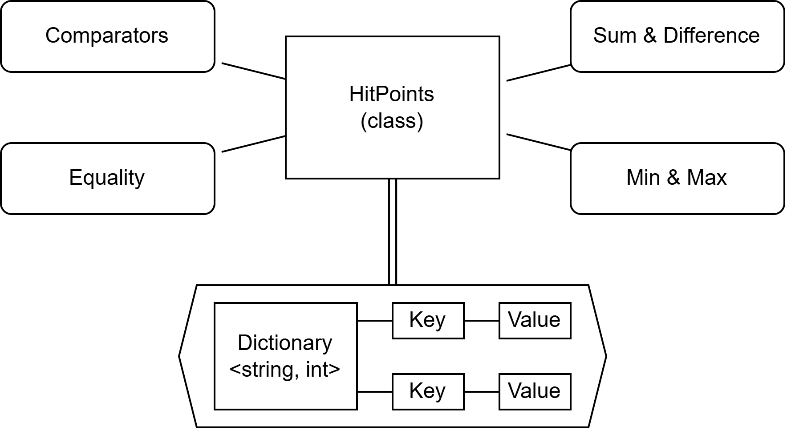

# Health
The health is represented by a dictionary that maps string into int. This structure can be used to model health as phisical healt plus armor and magical armor, or the health of single limbs.

The class implements comparators, equality operators, sum and difference operators, min and max operators.
Since a dictionary is not comparable, it is defined a cumulative value that represents the sum of all the integers contained in the dictionary that is used to define an order and is used by various operators.

## Customization and limitations
The main points that can be customized are:
- The sum and difference operators. Change how the different keys are updated.
