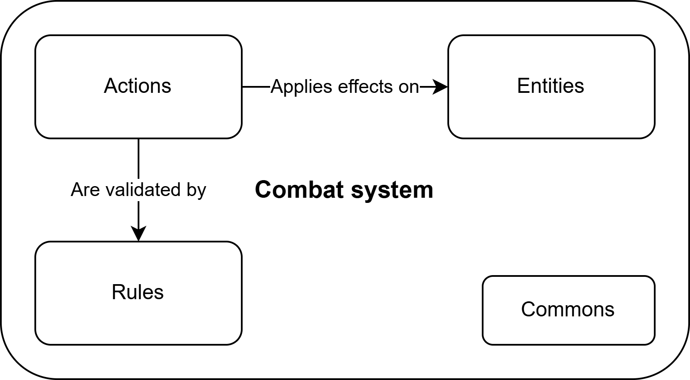

# Intro
This repository aim to build a simple, extensible, and customizable combat system.
The features were designed for a team, turn-based combat.

## Architecture
There are 3 pillars that compose the fundaments of the architecture:
- Entities: the entities that interact in the fight
- Actions: the actions that the entities can performs
- Rules: the rules that the action need to satisfy to be performed
Other than this, there are other elements that are not strictly specific to these pillars and falls in the generic area of "commons", e.g. the health.

The combat system lies heavily on this pillars: its tasks are limited to checking the validity on the actions using the rules and to apply their effects on the entities.

More details can be found in the following sections:
- Pillars
    - [Entities](pillars/entities.md)
    - [Actions](pillars/actions.md)
    - [Rules](pillars/rules.md)
- Commons
    - [Health](commons/health.md)

## Combat Rules
The implementaiton of the set of actions, rules, and entities' properties, defines how the combat system works. The features of the resulting combat systems is described for each version of the library in the following sections:
- [Combat Rules v0.1.0](features/combat-rules-v0.1.0.md)
