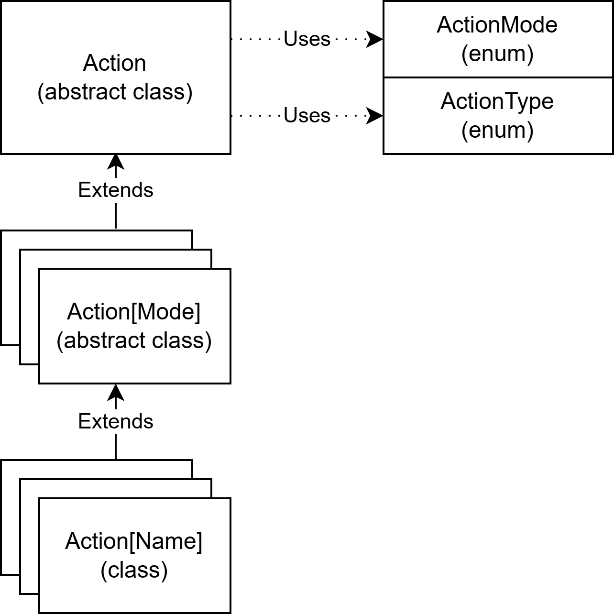
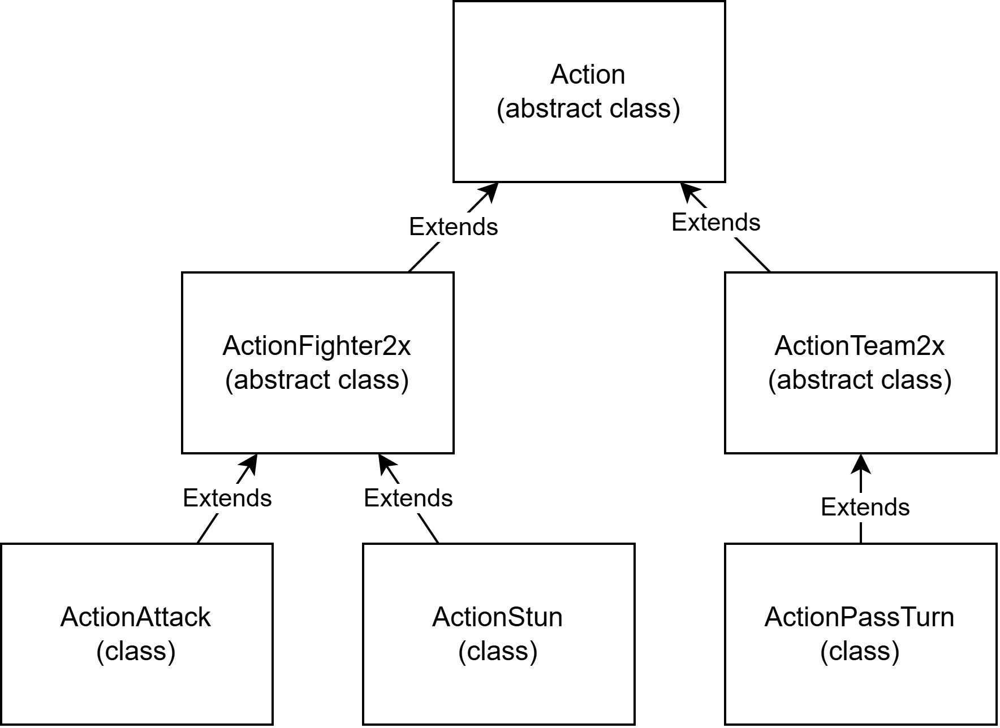

# Actions
The actions pillar categorize and implement the actions that the entities can perform. The classification is supported by two enums that contains the possible types of actions (type) and the possible sets of entities they involve (mode).

The general concept of action is expressed by an abstract superclass that simply define the classification for the action, then there are two more layer of classes that specify both type and mode. The first layer of subclasses contains abstract subclasses of the generic action that implements behavior specific to the entities involved (e.g. specific to actions that require two fighters). The second layer of subclasses contains non-abstract classes that define the behavior for specific type of actions (e.g. an attack action that involves two fighter).

## Customization and limitations
The main points that can be customized are:
- The mode enum. Define all the desired set of input an action can have.
- The type enum. Define all the action types desired.
- The action mode subclasses. Add all the subclasses required to cover all the modes.
- The specific action class. Add all the classes required to implement all the action types.

## Example
The Action abstract class is extended by ActionFighter2x, that represents a generic action that requires 2 fighters, and by ActionTeam2x, that represents a generic action that requires 2 teams.
Then ActionFighter2x is extended by the non-abstract classes ActionAttack and ActionStun that define two specific types of attacks between fighters, while ActionTeam2x is extended by ActionPassTurn that implements the turn-based mechanic.

