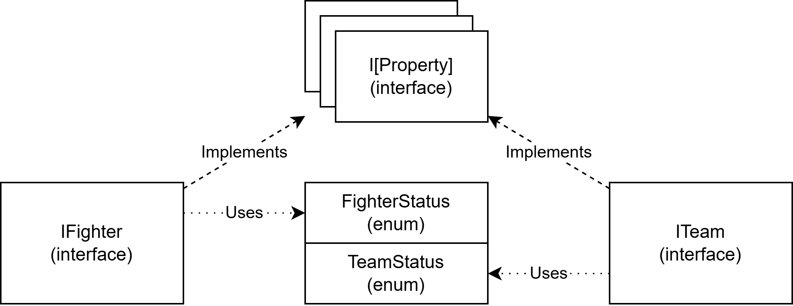
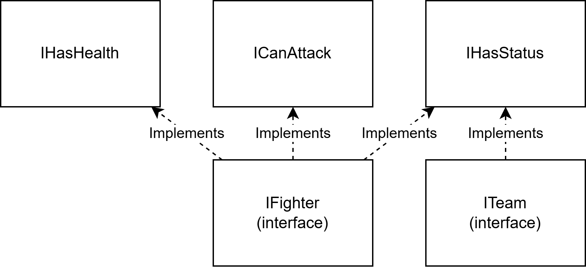

# Entities
The entities pillar comprehend the fighters, that are actually the entities that fights, and the teams, that does not performs action directly but are required to define a winner and to manage rules that have a broader scope than the single fighter.
Both these entities can have properties and competences that specify which actions can perform.
The properties/competences are represented by interfaces; the teams and the fighter are represented by interfaces that implements a set of properties/competences.

Both fighters and teams have a simple status system (represented by an interface property) to store properties like "Dead" for the former and "Winner" for the latter.
The set of valid properties they can have is stored in a pair of enums.

## Customization and limitations
The main points that can be customized are:
- The property interfaces. Add as many properties as needed to have all the desired behaviours.
- The fighter interface. Choose the subset of properties that a fighter has.
- The team interface. Choose the subset of properties that a team has.
- The fighter enum. Define all the status desired for the fighter.
- The team enum. Define all the status desired for the team.

## Example
The fighter interface IFighter implements IHasHealth, to view and update the health of an entity, ICanAttack, to generate an attack, and IHasStatus, to keep the internal state of the fighter.
The team interface ITeam implements only IHasStatus, to keep the internal state of the fighter.

