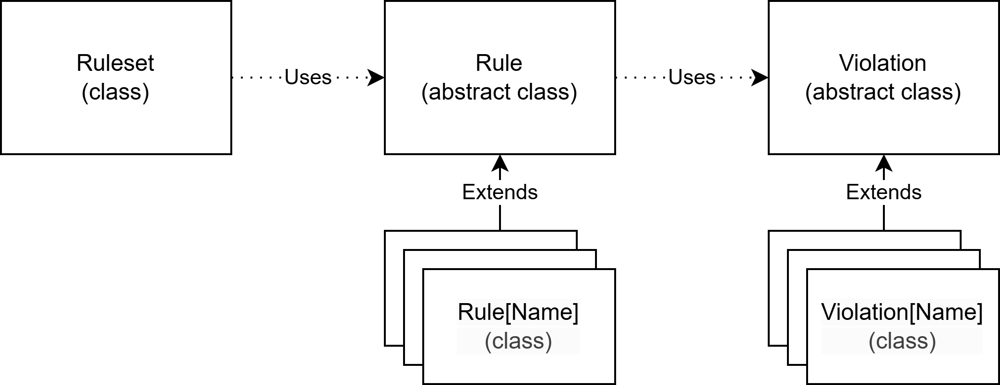
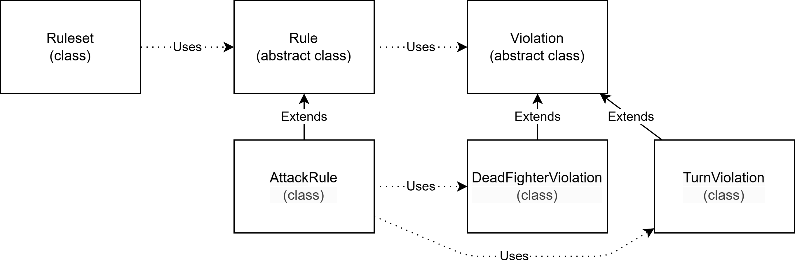

# Rules
The rules pillar comprehend rules, that analyze actions to check their vaildity, violations, that describe failures that can occur during rules validation, and the ruleset, that perform a validation over a set of rules.

The ruleset is a collection of rules and is used to overall validate an action: all the single rules are applied to the action and all the validations are retrieved.

## Customization and limitations
The main points that can be customized are:
- The rule classes. Add all the rules that must be enforced.
- The violation classes. Add all the violation that can occur during rule violation.

## Example
The Rule abstract class is extended by the AttackRule class that define how an attack action should be forme.
The Violation abstract classes is extended by DeadFighterViolation, that describe when a rule is violated due to a dead fighter, and by TurnViolation, that describe when a rule is violated due to the wrong turn.
The AttackRule may use DeadFighterViolation and TurnViolation in case a rule does not satisfy some criteria.
Ruleset is instantiated with a list of rules that comprehend only the AttackRule and will use that rule to valdate any action.

